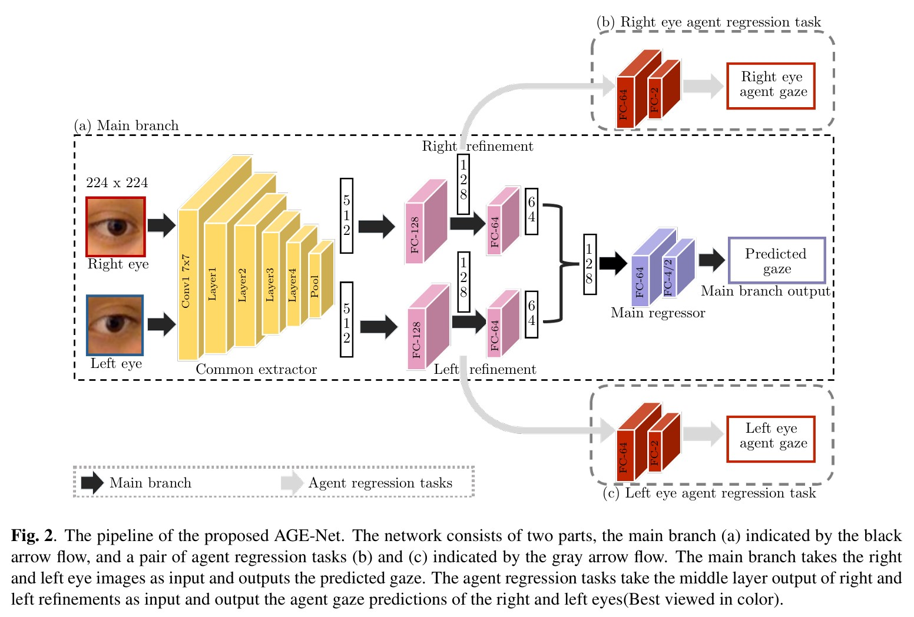
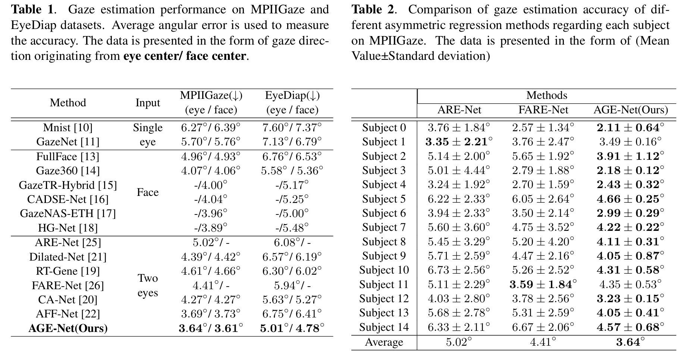

# ReadMe 

Codes for ICIP2024 [Agent-Guided Gaze Estimation Network by Two-Eye Asymmetry Exploration ](https://ieeexplore.ieee.org/document/10648029)

# AGE-Net 

Gaze estimation is an important task in understanding hu man visual attention. Despite the performance gain brought by recent algorithm development, the task remains challeng ing due to two-eye appearance asymmetry resulting from head pose variation and nonuniform illumination. In this paper, we propose a novel architecture, Agent-guided Gaze Estimation Network (AGE-Net), to makefull and efficient use of two-eye features. By exploring the appearance asymme try and the consequent feature space asymmetry, we devise a main branch and two agent regression tasks. The main branch extracts related features of the left and right eyes from low-level semantics. Meanwhile, the agent regression tasks extract asymmetric features of the left and right eyes from high-level semantics, so as to guide the main branch to learn more about the eye feature space. Experiments show that our method achieves state-of-the-art gaze estimation task performance on both MPIIGaze and EyeDiap datasets.



# Performance



# Usage

## Experiments of EyeDiap

 gaze direction originating from eye center:

```
python3 trainer_eyediap_v8_2_L1_loss_eye_centered_resnet_handwrite_droplast_left_right_branch.py
```

gaze direc tion originating from face center:

```
python3 trainer_eyediap_v8_2_L1_loss_resnet_handwrite_droplast_left_right_branch.py
```


## Experiments of MPIIGaze

 gaze direction originating from eye center:

```
python3 trainer_mpiigaze_v8_2_L1_loss_eye_centered_resnet_handwrite_droplast_left_right_branch.py
```


```
python3 trainer_mpiigaze_v8_2_L1_loss_resnet_handwrite_droplast_left_right_branch.py
```


## Modify the experimental parameters

### In these trainer* .py files, the settings after 'if __name__ == '__main__':' are set to experimental settings

```

    testindex_fold = 1 #Set which test set is for multi-fold cross-validation
    result_save = '/home/workspace/your_save_path/SaveResult'
    model_name = "gaze_eyediap_v8_depth3_resnet_SEPRE_lookat_resnet_correct_left_right_feature_branch"

    experiment_name = model_name#The experiment name is used to set the name of the folder where the checkpoint of the experiment is saved, and it will be used for the line of experiments on MPIIGaze. 
   							    #experiment_name = model_name.replace('eyediap', 'mpiigaze').
    result_save_log_path  = os.path.join(result_save,
                         time.strftime('%Y-%m-%d-%H-%M', time.localtime(time.time()))+ experiment_name+"_person"+ str(testindex_fold) +"_testindex"+"_batchsize4" )


    if not os.path.exists(result_save_log_path):
        os.makedirs(result_save_log_path)
    
    log_file = os.path.join(result_save_log_path, experiment_name +"_person"+ str(testindex_fold)  + "_testindex" +"_batchsize4" +'_exp.log')

    logging.basicConfig(level=logging.INFO,
                    format='%(levelname)s: %(message)s',
                    filename=log_file,
                    filemode='w')
    console = logging.StreamHandler()
    console.setLevel(logging.INFO)
    logging.getLogger('').addHandler(console)


    trainer = GazeTrainer(
        batch_size_train = 4 ,
        batch_size_val = 4,
        num_workers = 2,
        # trainer parameters
        is_cuda=True,
        exp_name = model_name,
        result_root  = result_save_log_path,
        test_choose = testindex_fold
    )
    #trainer.train_headpose(10, lr=2e-1)
    learning_rate = 1e-5
    total_epochs = 30
```

###  Hard-coded parameters in the class GazeTrainer (Trainer).

```
self.eyediap_image_path = '/data/Eyecenter_MPIIFaceGaze_224_not_flip/Image'#Set the dataset path
self.eyediap_label_path =  '/data/Eyecenter_MPIIFaceGaze_224_not_flip/Label'
```

```
        for epoch in range(self.extras.last_epoch_base + 1, epochs):#设置学习率
            if(epoch<20):
               self.temps.lr =  1e-2
            elif(epoch<30):
               self.temps.lr =  1e-3
            else:
                self.temps.lr =  1e-4

```

```
pth_load_dir = " "no_/home/workspace/your_save_path/SaveResult/2022-05-31-05-07gaze_eyediap_v2_depth3_fc_lrclus2test_batchsize4/checkpoint""#If you need to preload parameters, use them to save the path
load_epoch = "epoch_73.pth.tar"#Select the checkpoint to load
```

### Description of the call library

```
import os

from matplotlib.pyplot import tricontour
os.environ['CUDA_VISIBLE_DEVICES']='0'
from utils.trainer import Trainer
import torch as th
from torch.utils import data
from torch import optim
from torch import nn
import torch.nn.functional as F
from torchvision import transforms
from torchvision.utils import make_grid, save_image
import visdom
import utils.vispyplot as vplt
from data import read_diap_with_depth_eyecenter
import numpy as np
import fire
import logging
import time
import models
from models import adaptive_wing_loss
import json

```

> The most important libraries are models and data, the models folder contains the AGE-Net model, and the data folder contains the data read file.

#### AGE-Net models

- ```models/gaze_eyediap_v8_depth3_resnet_SEPRE_lookat_resnet_correct_left_right_feature_branch.py``

  For gaze estimation with the center of the face as the origin (the final FC output dimension is 2, which is the azimuth of a gaze from the center of the face$[yaw，pitch]$）

- ```models/gaze_eyediap_v8_depth3___**eyecentered**___resnet_SEPRE_lookat_resnet_correct_left_right_feature_branch.py```

  For  gaze estimation with the center of the eye as the origin (the final FC output dimension is 4, which is the azimuth of the two gaze directions from the center of the two eyes$[yaw_l，pitch_l,yaw_r，pitch_r ]$）

  
  
  The model contains resnet34, s a shared weight common feature extractor ( CE). 
  
  class Decoder : The Decoder class corresponds to the other parts except CE.
  
  
####   Reading data

- - ```data/read_diap_with_depth.py```  For gaze data  with the center of the face as the origin.

  - ```data/read_diap_with_depth_eyecenter.py```For gaze data  with the center of the eyes as the origin.

    

- MPIIGaze

  - ```data/read_mpiiface.py```   For gaze data  with the center of the face as the origin.
  - ```data/read_mpiiface_eyecenter.py```For gaze data  with the center of the eyes as the origin.

# Dataset preprocessing

The dataset preprocessing method refers to the code in gazeHub [For 2D Gaze Estimation - GazeHub@Phi-ai Lab.](https://phi-ai.buaa.edu.cn/Gazehub/2D-dataset/).


## Eyediap

```Cluster Diap face3D. py``` clusters the 14 subjects of EyeDiap into 4 subsets. 

### eye-centered gaze

data_processing_diap_**eye_center**__with_depth.py

**eyecenter**_data_processing_core.py

### face-centered gaze

data_processing_all_eyediap_with_depth.py

data_processing_core.py

## MPIIGaze

## eye-centered gaze

data_processing_mpii**Eye3d**_use_notflip_224.py 主函数

data_processing_core_not_get_lmk.py 核心函数

## face-centered gaze

data_processing_mpiiFace3d_use_notflip_224.py
data_processing_core_not_get_lmk.py
